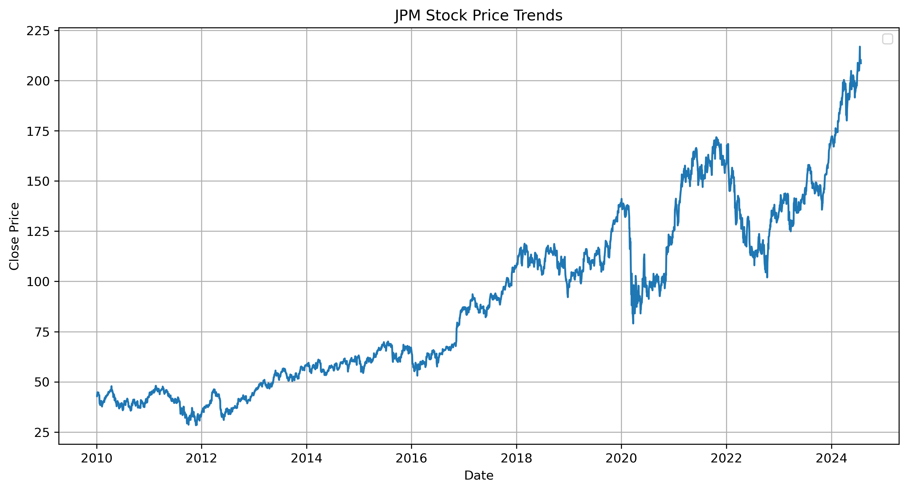
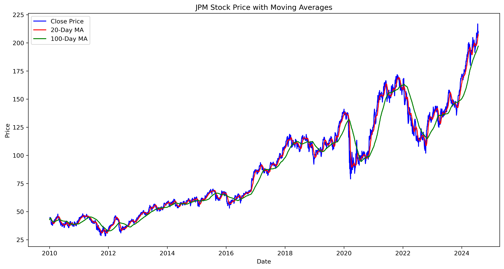
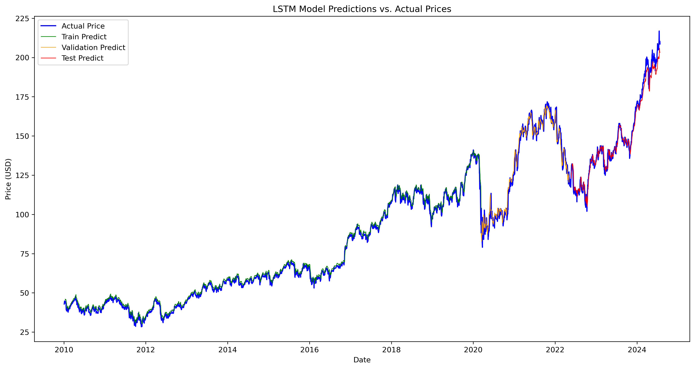

# JPMorgan_Stock_Price_Prediction

  <strong style="font-size: 24px;">Welcome to the Stock Price Prediction with LSTM repository! 📈</strong>

  

 In the fast-paced world of finance, making informed decisions can be the difference between profit and loss. This project harnesses the power of cutting-edge deep learning techniques to predict stock market trends, providing valuable insights that can guide your investment strategies.

Using Long Short-Term Memory (LSTM) networks—a specialized form of recurrent neural networks (RNNs) designed to capture and model temporal sequences—I dive deep into historical stock data to uncover patterns and predict future price movements.

**🌟 Key Features**
- **Advanced LSTM Modeling:** I employed sophisticated LSTM architecture to analyze and predict stock prices with impressive accuracy.
- **Comprehensive Data Analysis:** Explore detailed visualizations to track model performance against actual stock prices.
- **Real-World Application:** My approach is designed for practical application, helping investors and financial analysts make data-driven decisions.
  
Whether you're a data enthusiast, a finance professional, or someone curious about the intersection of AI and the stock market, this project offers a comprehensive toolkit for understanding and predicting market behavior.

### Project Goals:
- To build a predictive model using LSTM that accurately forecasts stock prices.
- To analyze the model's performance through visual comparisons and identify areas for improvement.

### Tools & Libraries:
- Python
- TensorFlow/Keras
- Pandas
- Matplotlib
- Scikit-learn

## Visualizations

1. **Closing Price of the Stock**
The following graph displays the closing prices of the stock over time. This historical data is crucial for training the LSTM model.

  

Figure 1: Closing Price of the Stock

2. **Moving Averages of the Stock**
The moving averages provide insight into the stock's trend over different periods. The following chart illustrates these moving averages along with the actual closing prices.

  

Figure 2: Moving Averages of the Stock

3. **Model's Price Predictions vs. Actual Prices**
This chart compares the LSTM model's price predictions with the actual stock prices, showing the effectiveness of the model in forecasting.

  

Figure 3: Model's Price Predictions vs. Actual Prices

## Summary

  <strong style="font-size: 24px;"> This repository showcases a project for predicting stock prices using Long Short-Term Memory (LSTM) networks. It includes code for training LSTM models, analyzing stock price data, and evaluating model performance. Key visualizations include historical stock prices, moving averages, and comparisons between predicted and actual prices. The project aims to provide valuable insights into JPMorgan & Co. stock market trends and support informed investment decisions through advanced deep learning techniques. </strong>

